# 2026 Investing Forecast

This post summarizes the 2026 investment landscape, highlighting challenges and opportunities.

Lots of markets are at all-time highs, new asset classes are outperforming, and the concentration of the S&P 500 index is higher than ever.

Here are some key takeaways from this post:

* Emerging markets and international stocks could outperform, especially if the dollar continues to depreciate
* Value stocks could outperform if valuation spreads narrow
* Fundamental indexing could outperform market cap weighting
* Considering “anything but market cap weighting.”

Let’s take a look at the recent performance of different asset classes and valuation metrics to identify some market aberrations.

## 2025 returns by asset class

See the following [BlackRock chart](https://www.blackrock.com/corporate/insights/blackrock-investment-institute/interactive-charts/return-map) with returns by asset class each year.

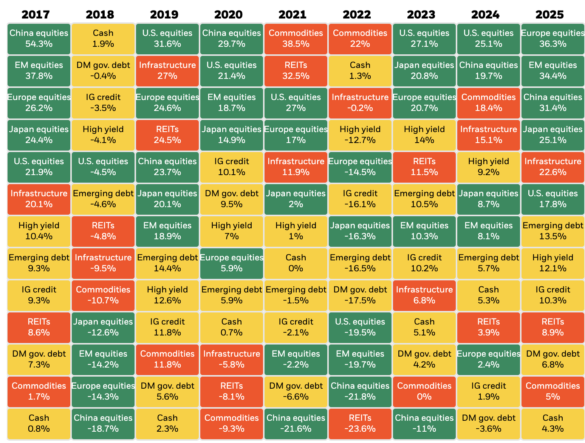

US equities delivered a solid return in 2025 (17.8%), but they underperformed emerging-market and European equities.  US equities have outperformed other equity markets for most of the past 9 years.

Here are the 2025 returns by equity market (in USD terms):

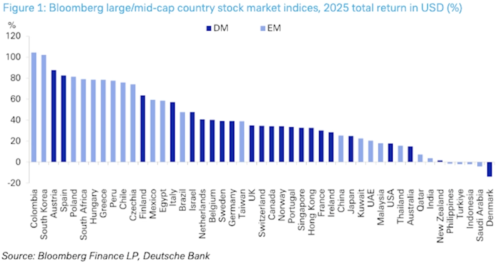

International equity markets delivered massive returns in 2025.  The returns are so huge that they almost make the 18% return in the US look small.  The returns in this chart are in US dollars, so they are juiced as most currencies appreciated against the dollar in 2025.

Here’s another graph showing 2025 performance by asset class.

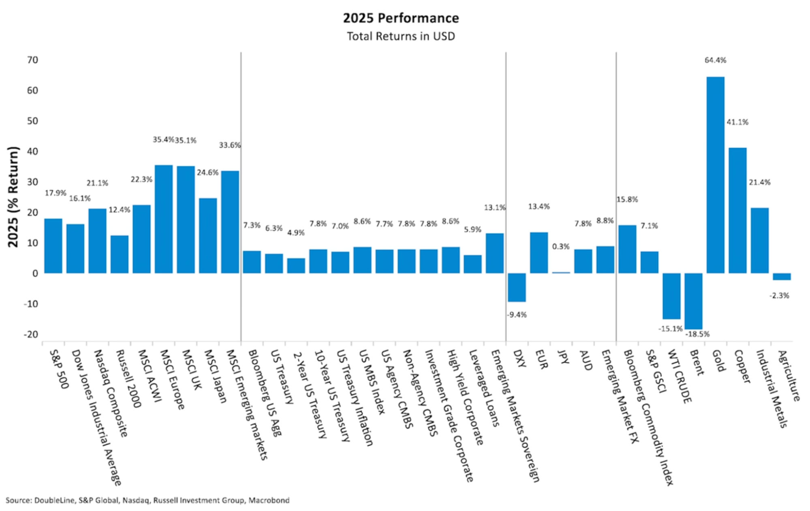

The US stock market delivered solid returns in 2025, but didn’t dominate other stock markets as it has in recent years.

Let’s turn our attention to the world stock market index and its composition.

## Total world stock market index

Here’s the regional asset allocation of the Vanguard Total World Stock Fund:

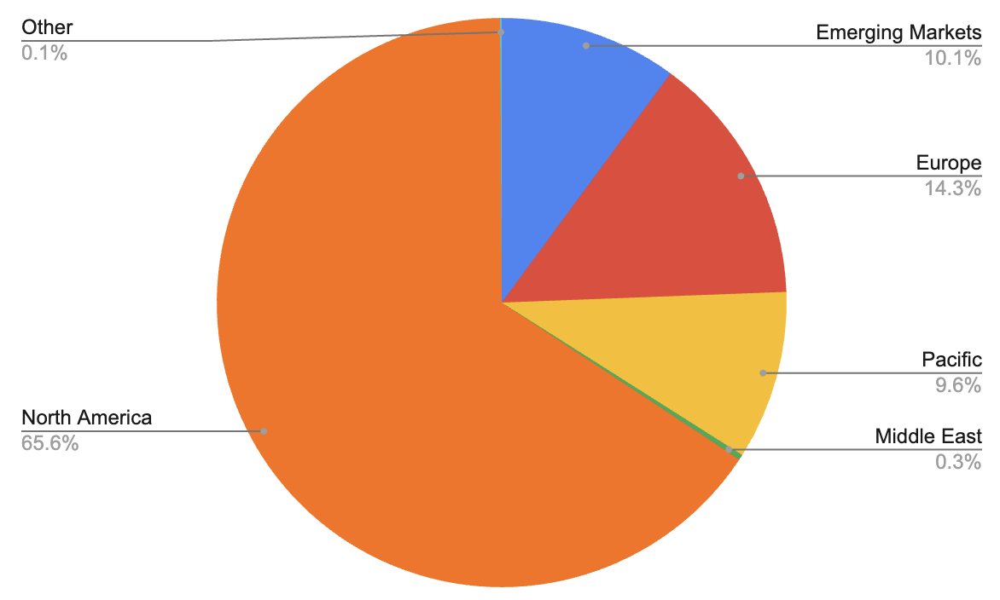

The United States' share of the global stock index has increased substantially since the late 80s.

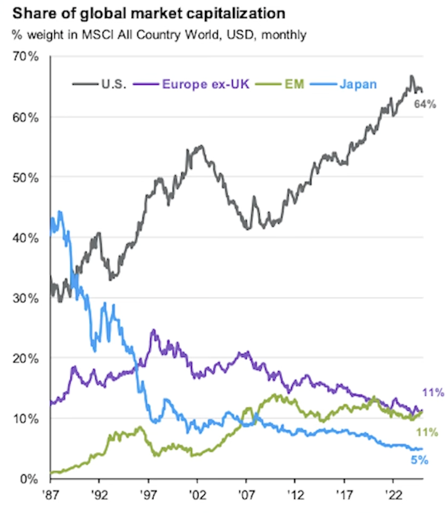

The Japanese market accounted for the largest share of the global index in the late 80s and now accounts for only 5%.  Famous Japanese companies like Toyota, Honda, Sony, and Nintendo are smaller than you’d imagine.  

There are stocks in the ACWI world index that have a higher weighting than entire countries:

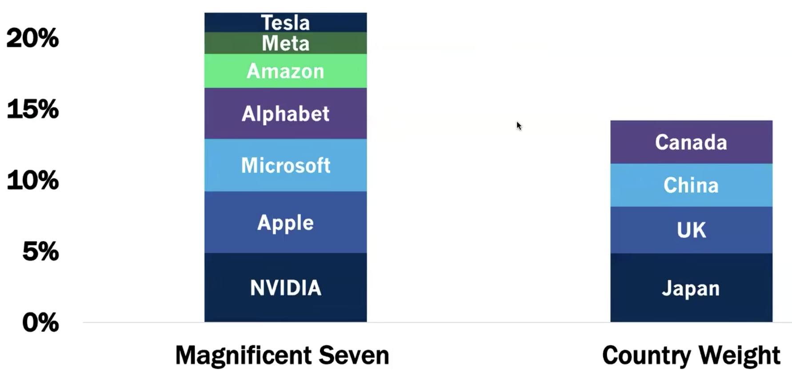

We will discuss these Magnificent Seven companies further later.

The US accounts for 25% of global GDP but 64% of global equity market capitalization.

Time will tell whether American exceptionalism continues or reverts to the mean.

## S&P 500 bull market

The S&P 500 index is on an amazing bull market run.

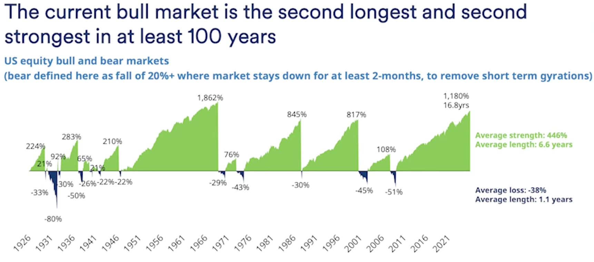

Let’s remember some arithmetic when analyzing this graph.  How much money will you make if you invest in an asset that subsequently increases by 300% and then decreases by 67%?

The answer is zero dollars.  Make sure to keep this in mind when interpreting the graph above.

Also, take another look at the graph and reflect on the adage that “markets take the stairs up and the elevator down.”  Bull markets last for 6.6 years on average, and bear markets last for 1.1 years.

Here’s a graph illustrating an equity index that halves, doubles, and then halves again.

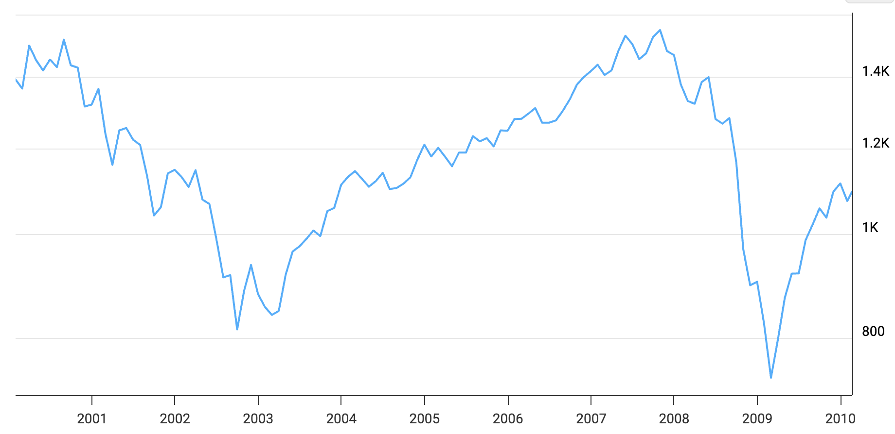

The graph above shows the S&P 500 from 2000 to 2010.  The 50% drawdowns from 2000-2002 and from 2008-2009 were painful.

If you bought the S&P 500 for 1,400 in 2000, then you were only left with around 1,100 at the start of 2010, and you had to weather two gut-wrenching drawdowns for the pleasure of holding the asset.

Let’s take a slight behavioral finance detour, so we can think about how investors “feel” about their investments at different points in history.  In 2009, people felt horrible about owning the S&P 500 index.  Right now, people feel amazing about owning the S&P 500, and just throwing more money into the index seems like an obvious choice.  Let’s explore this known behavioral finance phenomenon.

## Recency bias

Humans tend to disproportionately weight recent events over distant ones when making investment decisions.  Let’s take a look at the S&P 500 index performance from 2010 through 2025:

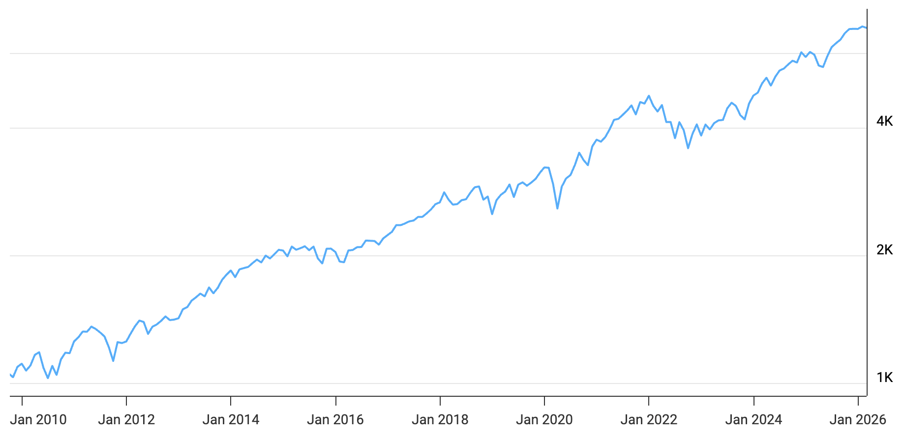

Just throwing money into the S&P 500 index has worked so well for so long.  We are in one of the longest S&P 500 bull markets in history.  

Many investors have automatic investment accounts set up, and their money is getting dumped into the S&P 500 index every paycheck.  Recent investment experiences have been very positive.  Vicious bear markets are a distant memory.  

The COVID crash in 2020 was 34% but only lasted 33 days, so it wasn’t particularly psychologically damaging.  If anything, that temporary dip just reinforces the thinking that downturns are just a blip that will quickly reverse.

S&P 500 owners are complacent.  And the vast majority of them are quite rich.  The top 10% of Americans by wealth hold 90% of the stock.  The wealthy have benefited substantially from this bull market.

Let’s take a look at the great 500 American companies that have fueled this wealth creation event.

## The magnificent 7 (Mag7)

The Mag7 companies include:

* Alphabet
* Amazon
* Apple
* Meta
* Microsoft
* NVIDIA
* Tesla

These are arguably the best companies in human history.  They make wonderful products, have satisfied customers, and print profits the likes of which the world has never seen.

Let’s take a look at Apple’s revenue and profit for the past four years:

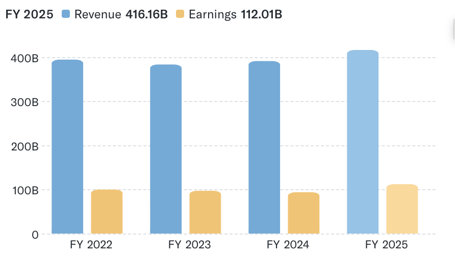

They generated over $100 billion in profit last year.

The Mag7 companies have driven the S&P 500's rise with their strong earnings.  In 2023, S&P 500 earnings grew 4.1%, but excluding Mag7, they would have declined 1.3%.  The Mag7 are the only reason the S&P 500 had positive earnings in 2023.

Not surprisingly, the Mag7 stock prices have risen massively over the past few years.  NVIDIA’s market cap ($4.5 trillion) is bigger than the market cap of the entire Russell 2000 (one company is worth more than the 1001-3000 biggest companies combined)!

NVIDIA accounts for approximately 7% of the S&P 500 index.  This massive weighting is causing the S&P 500 to reach its highest concentration in history.

## S&P 500 concentration

Here’s the concentration of the top 10 stocks in the S&P 500 index from 2010 to 2025.

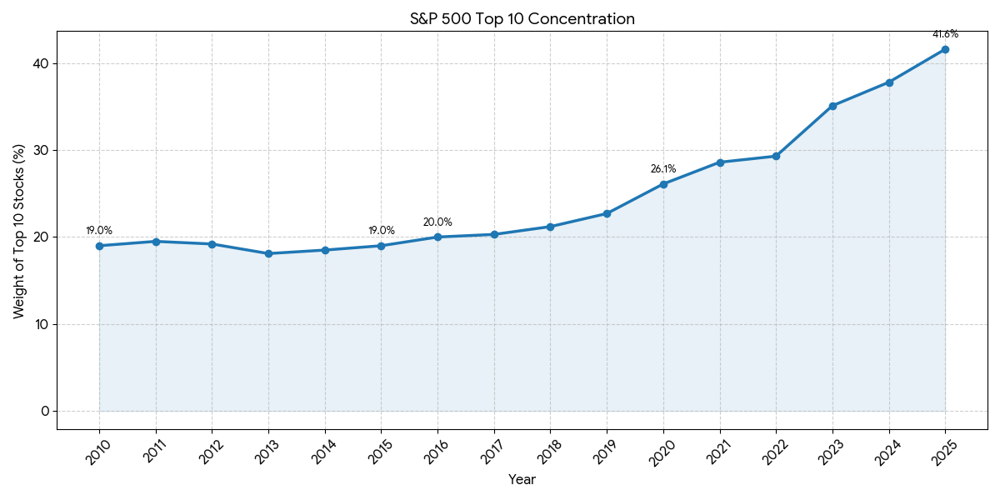

In 2010, the top 10 stocks accounted for only 19% of the S&P 500's return.  Now it’s 42%.

The S&P 500 index is market-cap-weighted, so larger companies carry greater weight.  We will explore alternatives to market-cap weighting later in this post.

## The incredible 493

Let’s not forget about the other amazing 493 companies that comprise the S&P 500 index.  These companies include Coca-Cola, Walmart, Chase, Visa, and Exxon.

Many of the incredible 493 companies have been printing profits for years or even decades.

The Mag7 has outperformed the Incredible 493 in recent years, but that trend could always flip. The Incredible 493 may be the biggest beneficiaries of AI, using it to expand its profit margins like never before.

Let’s take a look at the biggest company in the world by year to see when some of these Incredible 493 companies were the biggest company in the world.

## The biggest company in the world

Here’s a list of the biggest companies in the world by year:

**2000:** Microsoft (Briefly overtaken by Cisco Systems in March)

**2001:** General Electric

**2002:** Microsoft

**2003:** Microsoft

**2004:** General Electric

**2005:** General Electric

**2006:** ExxonMobil

**2007:** ExxonMobil (PetroChina briefly held the title after its Shanghai IPO)

**2008:** ExxonMobil

**2009:** ExxonMobil

**2010:** ExxonMobil

**2011:** ExxonMobil (Apple overtook it for the first time in August)

**2012:** Apple

**2013:** Apple (ExxonMobil briefly reclaimed the top spot early in the year)

**2014:** Apple

**2015:** Apple

**2016:** Apple

**2017:** Apple

**2018:** Apple

**2019:** Microsoft

**2020:** Apple

**2021:** Apple

**2022:** Apple (Saudi Aramco held the title for part of the year due to high oil prices)

**2023:** Apple

**2024:** Microsoft (Overtaken by NVIDIA in June; Apple also held the spot later in the year)

**2025:** NVIDIA

The world's top company sometimes delivers on expectations.  Apple was the world's largest company in 2012 and continues to grow.

General Electric got crushed after holding the top spot.

Let’s take a deeper look at Cisco, which briefly held the title of the world's largest company in 2000.

## Great companies with massive expectations

Cisco is an amazing company that recently surpassed its March 2000 high stock price.

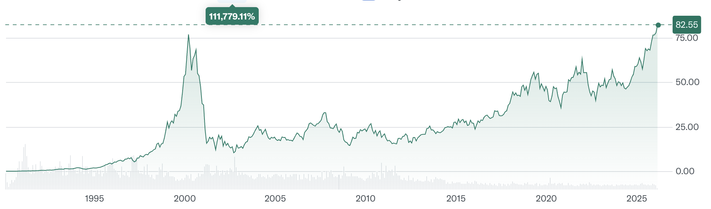

Cisco supplied products to build internet infrastructure, and its business grew rapidly during the late-1990s internet boom.  Everyone knew that Cisco was a great company and would capitalize on the inevitably massive internet market.  And everyone was right!  Take a look at Cisco’s financials for the past few years.

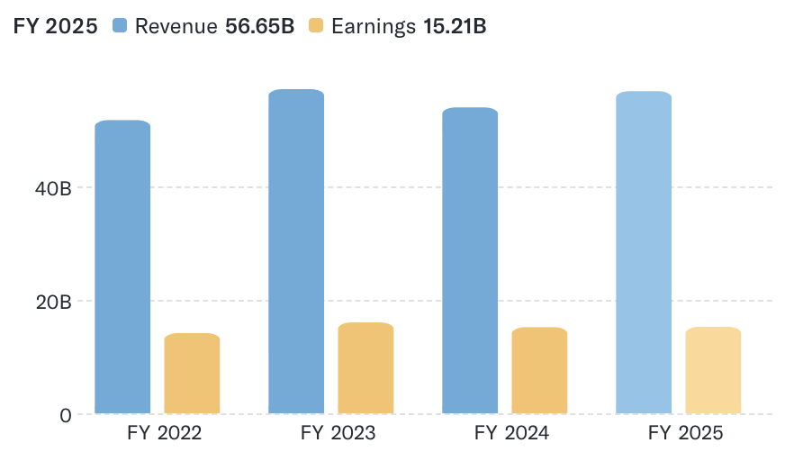

Cisco made 15 billion dollars last year - they are printing cash!

You may wonder why this notable company had a flat stock price for 25 years.

Let’s look at the two components of a company’s valuation:

* The actual underlying business (sales and profits)
* The market expectations for the future (valuation multiple)

In 2000, the market expected Cisco's earnings to grow 40% per year.  Cisco grew earnings by only 8% per year, a disappointment given elevated market expectations.  The gap between expectations and actual results is the amount of disappointment (or happy surprise).  

Again, it’s weird that we’re calling the $15 billion earnings a disappointment.  Let’s compare the Cisco earnings with those of some French companies to put this in perspective.  France is one of the world's largest economies, and Cisco earned more than any French company last year.

Companies like Tesla are now “priced for perfection”.  The market expects Tesla to be perfect.  Anything less than perfect would be a disappointment.  Let’s look at Tesla’s financials for the last few years:

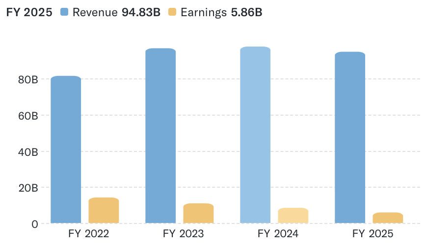

Tesla has a market cap of 1.5 trillion and a forward P/E of 192.  Sales and profits are declining, so this rich valuation is surprising.  You normally see companies that enchant investors with rapidly growing sales and earnings.

The market clearly expects Tesla’s financial performance to improve and for the company to rapidly increase sales and generate profits exceeding $60 billion annually.  

## AI is the real deal and will change everything

The Mag7 companies are leaders in AI.  Again, everyone knows AI will change the world.

There have been many instances in human history when it was obvious that “TechnologyX is the real deal and will change everything.”  Some examples:

* Indoor plumbing
* Electricity
* Railroads
* Steam engine
* Airplanes
* Internet

Revolutionary technologies don’t necessarily make great businesses.  Air travel has changed the world.  But the total net profit of airlines since inception is roughly zero.  It’s not a good business for making money.

AI will revolutionize our world.  But value is the discounted net present value of future cash flows.  If you want to make money in the AI trade, you need to compare value to market pricing.

Let’s take a look at some of these rich valuation metrics.

## Asset valuations

Here is the Shiller price-to-earnings ratio since World War 2:

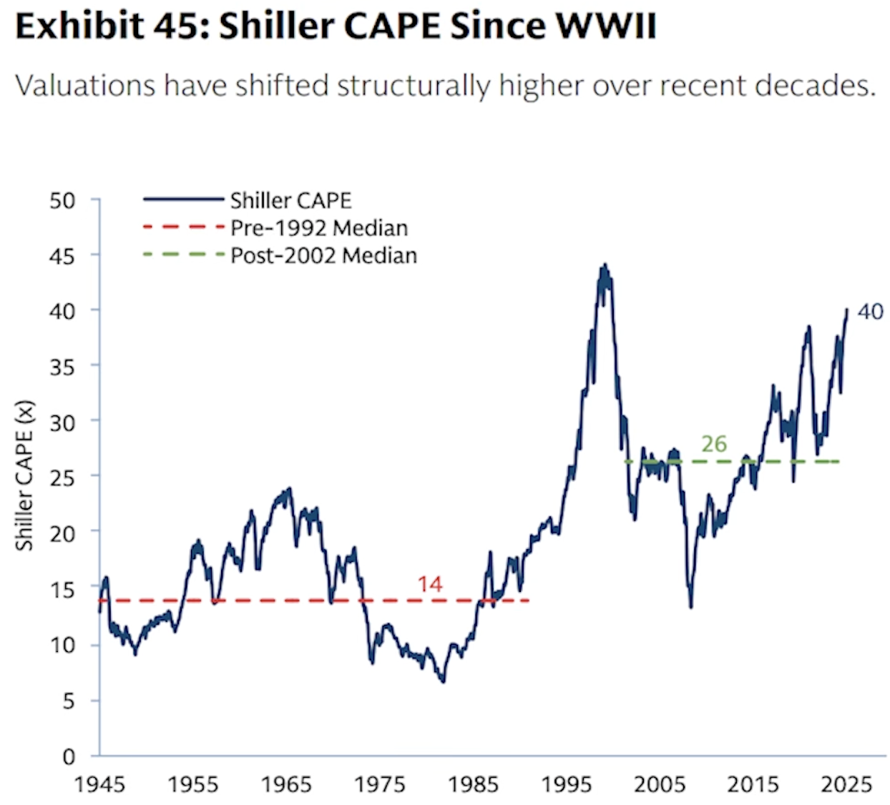

The Shiller P/E ratio divides price by the 10-year average of earnings to smooth out volatility.  Smoothing earnings can be better than other measures like a trailing P/E or forward P/E, which only look at a single year, but can also be somewhat misleading if this index contains lots of rocketship companies with fast-growing earnings.  Look at the NVIDIA earnings, for example:

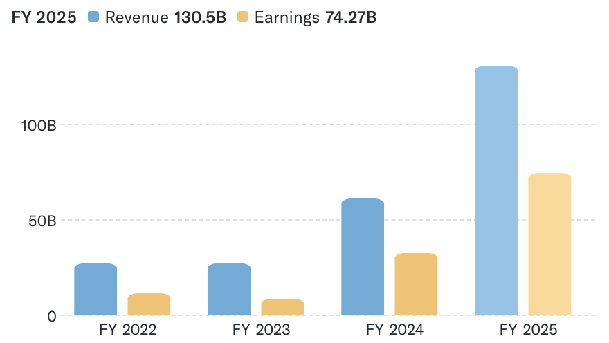

NVIDIA has massively expanded its business, and the 10-year average earnings just understates reality.  For some companies, a 10-year average of earnings smooths volatility, but it’s misleading for NVIDIA.

The US CAPE has significantly diverged from the global CAPE in recent years:

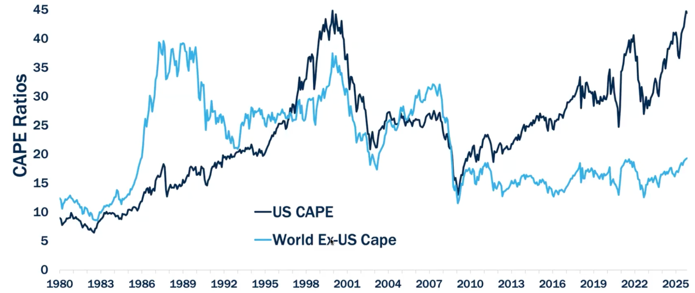

In early 2009, when the CAPE ratio was 13, buying the S&P 500 index was an easy decision.  Warren Buffett published the [“Buy America” article](https://www.nytimes.com/2008/10/17/opinion/17buffett.html) in late 2008. When the stock market for the world's best economy is on sale, buying is clearly a good decision.

Let’s look at another graph showing valuations for different asset classes under different valuation criteria.

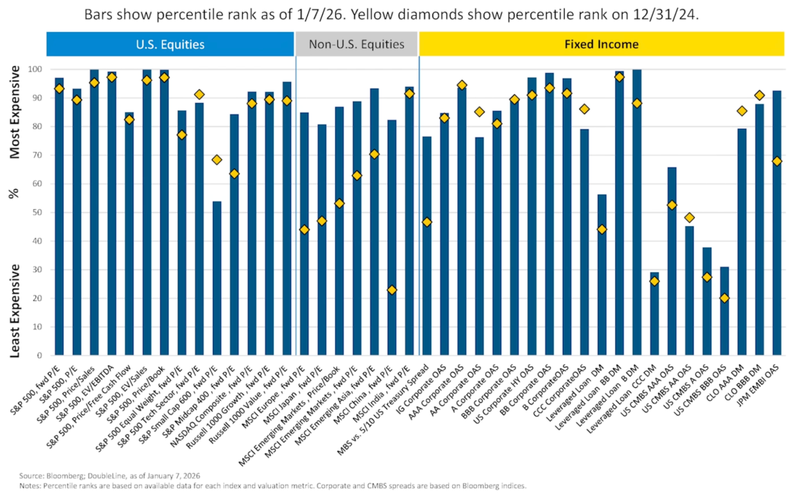

Many valuation metrics for U.S. equities are in the top decile.  Valuation metrics for non-US equities are also quite high.

Let’s take a look at the prices/sales ratio in more detail.  The following graph shows the percentage of stocks trading at 10 times sales.

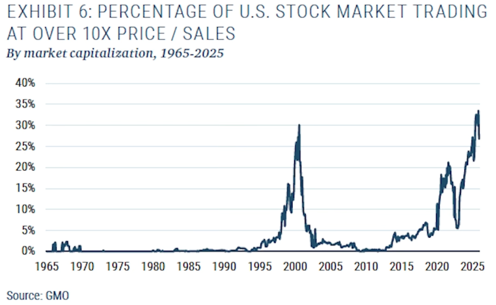

The S&P 500 growth-value chart shows that growth outperformed in the late 1990s, value outperformed from 2000 to 2007, and growth has outperformed since 2008.

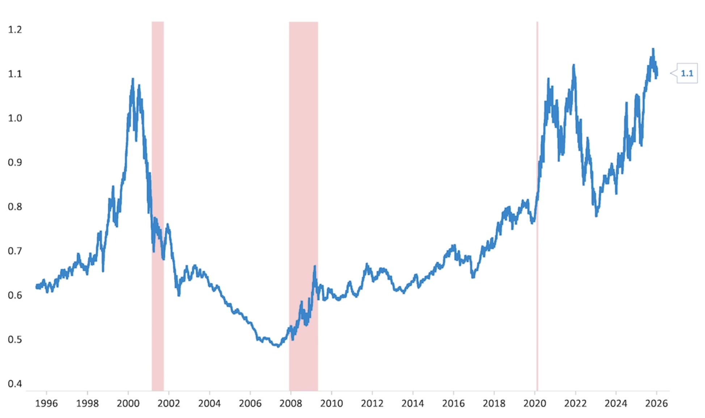

Let’s take a look at the ratio of US equity prices vs. the rest of the world.  

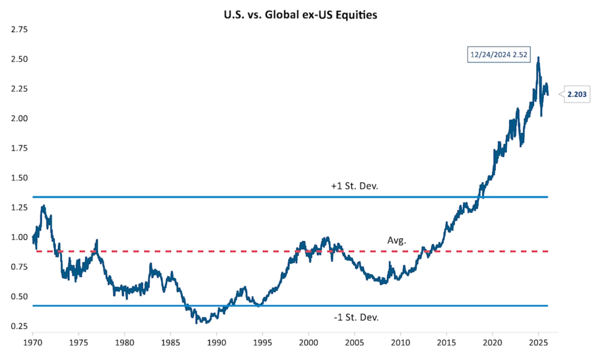

The US has been greatly outperforming since 2010.  In 2020, the American outperformance broke out of the one-standard-deviation band it had fluctuated within since the 1970s.

This trend has been dubbed “American exceptionalism”: the belief that U.S. stocks and assets will continue to outperform.

This graph shows the S&P 500 index and the emerging markets index above, and the ratio of the two below.

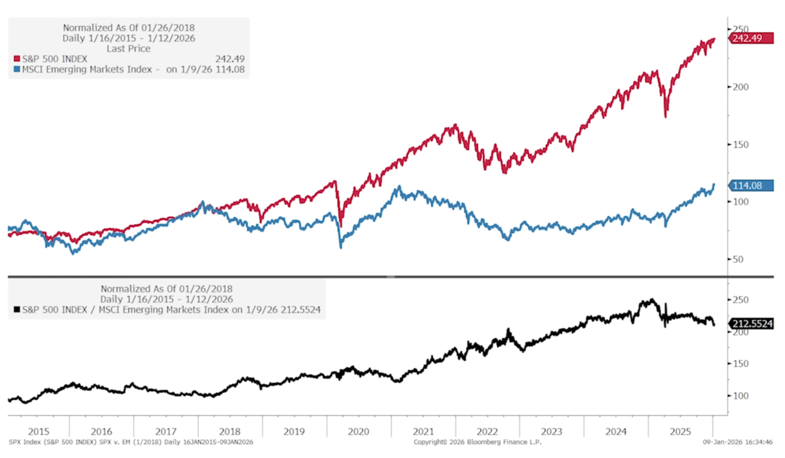

The US has significantly outperformed emerging markets over the past several years, but that outperformance began to reverse in 2025.

## Great news vs. great returns

Let’s take a look at some of the headlines from Colombia, the top-performing equity market in USD terms in 2025:

* **Assassination of Miguel Uribe Turbay:** The killing of this prominent senator and presidential hopeful during a campaign event fundamentally reshaped Colombia's political landscape and security protocols.
* **Labor Reform Approval:** President Petro signed a landmark bill that increased workers' benefits, such as overtime and night premiums, while introducing new regulations for gig-economy workers.
* **U.S.-Colombia Tension:** Diplomatic relations hit a historic low following Colombia's decertification in drug-fighting efforts and disagreements over immigration and military presence.
* **Belt and Road Initiative:** Colombia formally aligned with China's global infrastructure project to secure major investments and reduce its economic dependence on traditional Western partners.
* **Catatumbo Conflict:** A breakdown in peace talks led to a massive military offensive and a declared state of emergency in the northeast to combat escalating violence between armed groups.

Most of these headlines feel like bad news.  Remember that “good news” and “good stock market returns” are different.  

## 30-Year Treasury

The 30-year Treasury is the interest rate the U.S. government pays investors who lend it money for 30 years.

It’s worth reflecting on the 30-year Treasury yield over the past few years.

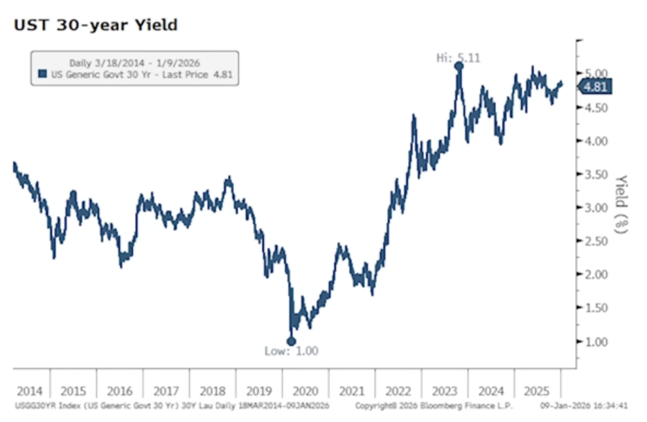

The 30-year Treasury yield was in a 39-year downward trend from 1981 until the March 2020 COVID-19 low. 

The Fed controls short-term rates, and from 1980 to 2019, long-term rates fell when it cut short-term rates.  This relationship has since broken down, and long-term rates have risen during the Federal Reserve's rate-cutting cycle from 2024 to 2025. Factors other than the Federal Reserve are now driving long-term rates.

The following graph shows that the 30-year U.S. Treasury rate has broken out of its long-term trend lines and is now rising.

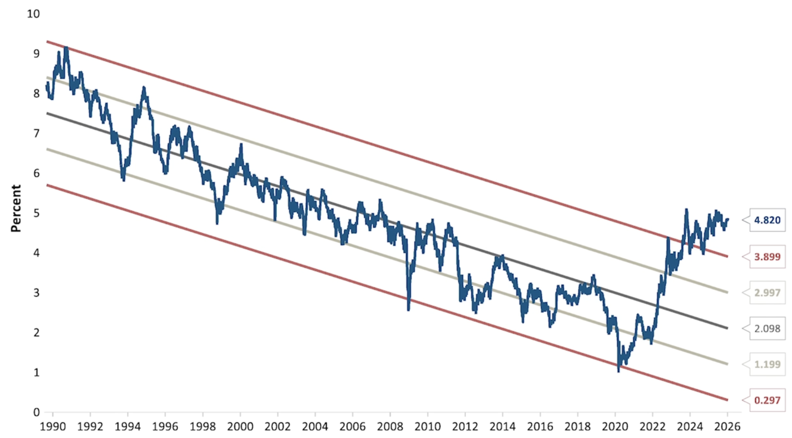

The next graph shows the max drawdowns in the 30-year Treasury.  When the price of 30-year Treasuries rises, then bond prices fall.

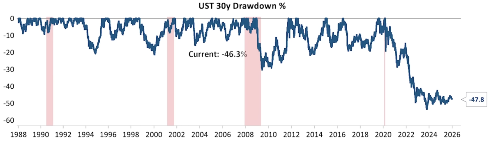

The current drawdown is massive. Lending the U.S. government for 30 years at an interest rate of 1% was a bad idea.

Let’s turn our attention to another asset class that has been performing differently recently.

## The ascent of gold

Gold has rocketed to all-time highs recently:

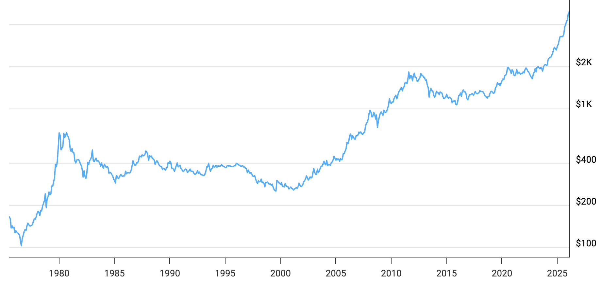

According to the legendary interest rate observer Jim Grant, “The price of gold is the reciprocal of investor confidence in central bankers.”

That’s concerning - according to that logic, investors are not confident in central bankers at the moment.

A variety of geopolitical factors are driving gold higher, and it’s clear that times are changing.

## US Dollar Index

The dollar has been falling recently, as you can see in the following chart:

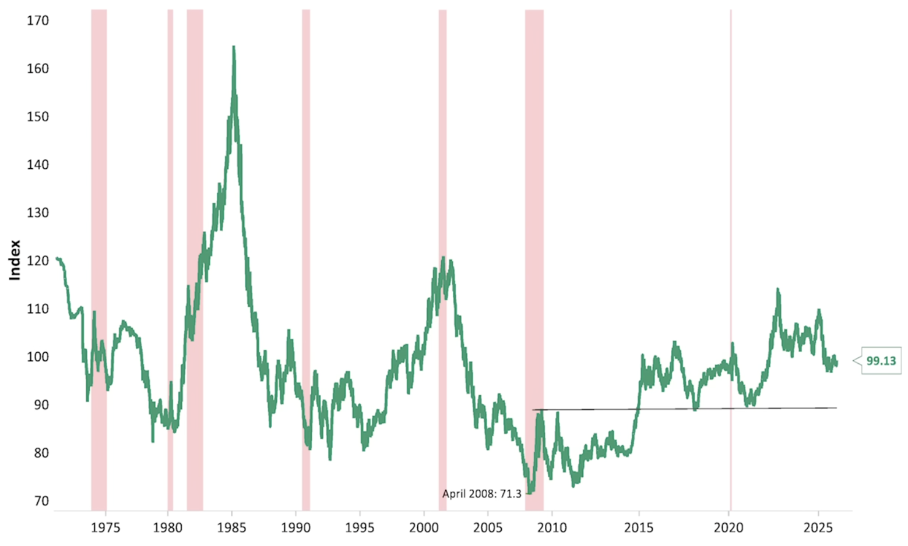

The depreciation of the U.S. dollar in 2025 boosted returns on most foreign assets.

Ensure that you assess your U.S. dollar-denominated portfolio allocation.  

## Dividend yield

Now let’s take a look at the dividend yield for different markets around the world:

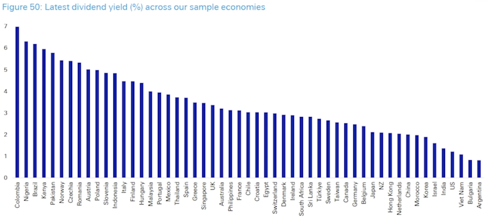

US dividend yields are near all-time lows, partly because there has been a big shift from dividends to buybacks, and partly because valuations are so elevated.

Even the “high-yield” dividend funds in the US have relatively low yields.  The Vanguard High Dividend Yield ETF, for example, has a 2.3% dividend yield.

## Anything but market cap weighting

Meb Faber recently argued that any fund weighting methodology should outperform market-cap weighting.  Here are other options.

* Fundamental weighting
* Multi-factor
* Small/mid-cap
* Equal weighting

Market-cap weighting assigns index weights to companies based on their market capitalization.  We’ve already discussed how the Mag7 companies are making the S&P 500 index more concentrated than ever.  Market-cap weighting will be beneficial if Mag7 continues to outperform.  Other indexing methodologies will outperform if the Mag7 doesn’t meet expectations.

## Core/satellite approach to investing

According to the efficient market hypothesis, all stock prices perfectly reflect all current and knowable future information.  Market participants will quickly buy more until an undervalued stock hits its fair value.  They will sell overvalued stocks until they hit fair value.

All stocks are properly valued, and index-country weightings are optimal under efficient-market theory.  Growth stocks are priced higher for their high future growth, value stocks are priced lower for their lower future growth, and financial participants collectively make the system efficient.  Mag7 dominance in index weights is justified based on current information.

Behavioral economics challenges the efficient markets hypothesis.  It’s clear that market participants can become emotional and don’t always act rationally.

If you think that you may be able to outsmart the market, but aren’t totally sure, then you can try the core/satellite portfolio management approach.  You allocate the majority of your funds in the total world stock market index/total world bond market index (passive allocation) and then a smaller portion to assets you think will outperform (active allocation).

You can increase the weight of your active allocation based on the strength of your convictions.

## Actionable next steps

You should review your portfolio and quantify your allocations across different segments—stocks, bonds, emerging markets, international stocks, etc.  Then quantify the extent to which your portfolio differs from the perfectly passive portfolio.  If you own the S&P 500, you have an overallocation to the US (because the global stock market index is ~40% non-US).

Then quantify your ability and willingness to take risks.  Your ability to take risks depends on your age, investment horizon, and income.  Your willingness to take risks reflects your psychological ability to handle market volatility.  Your overall risk tolerance reflects your ability and willingness to take risks.

Then check whether your asset allocation matches your risk tolerance.  You should invest in ways that don’t stress you out too much.

Your asset allocation is the most important factor for determining future returns.  You must get it right.

## Conclusion

I’ll conclude with some personal thoughts.

The Mag7 are the best companies in world history.  Some will greatly exceed expectations, and others will not.  I can envision a future in which these companies continue to outperform, or a world in which they are disrupted by newcomers or broken up under antitrust law.  I prefer the RAFI fundamental index weight to a company like Microsoft (2.6%) compared to the S&P 500 weight (7%).

I am bearish on long U.S. Treasuries and think the U.S. has a significant fiscal mess to sort out.  I’m optimistic that solving the issue down the road will be easier than you’d imagine.  Governments will use AI to identify waste, fraud, and abuse within the system, thus making balanced budgets attainable.

International stocks are priced attractively and may outperform the S&P 500 index.  The dollar seems overvalued, and international stocks may continue to benefit from dollar depreciation.
