# Brazilian Stock Market in 2026

This post examines the Brazilian stock market, recent performance, and expected future returns.

Brasil has one of the largest populations in the world, is relatively young, is abundant with natural resources and arable land, and is a stable Western democracy.

The Brazilian stock market rose rapidly from 2002 to 2008, crashed during the Global Financial Crisis, rebounded quickly, and has trended downward since 2010.  It’s now one of the cheapest stock markets in the world.

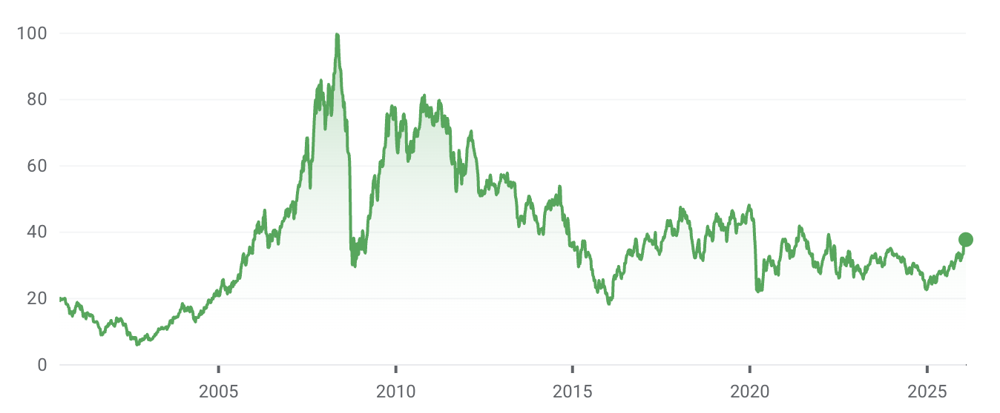

But the index is finally showing signs of strength. Look at the performance for the past year:

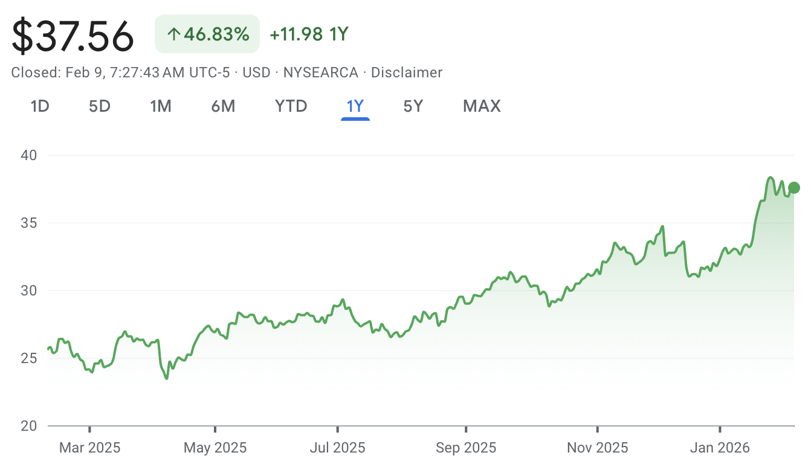

The iShares MSCI Brazil ETF (EWZ) has risen 47% over the past year, driven by the strong performance of the underlying assets and a strengthening of the Brazilian Real against the U.S. dollar.

Let’s take a look at the companies in the Brazil ETF.

## Brazil stock index components

The Brazil ETF contains 46 funds, and these are the largest holdings:

<table>
  <tr>
   <td><strong>Ticker</strong>
   </td>
   <td><strong>Name</strong>
   </td>
   <td><strong>Sector</strong>
   </td>
   <td><strong>Weight</strong>
   </td>
  </tr>
  <tr>
   <td>VALE3
   </td>
   <td>CIA VALE DO RIO DOCE SH
   </td>
   <td>Materials
   </td>
   <td>10.93
   </td>
  </tr>
  <tr>
   <td>NU
   </td>
   <td>NU HOLDINGS LTD CLASS A
   </td>
   <td>Financials
   </td>
   <td>10.77
   </td>
  </tr>
  <tr>
   <td>ITUB4
   </td>
   <td>ITAU UNIBANCO HOLDING PREF SA
   </td>
   <td>Financials
   </td>
   <td>9.23
   </td>
  </tr>
  <tr>
   <td>PETR4
   </td>
   <td>PETRÓLEO BRASILEIRO PREF SA
   </td>
   <td>Energy
   </td>
   <td>5.84
   </td>
  </tr>
  <tr>
   <td>PETR3
   </td>
   <td>PETRÓLEO BRASILEIRO SA PETROBRAS
   </td>
   <td>Energy
   </td>
   <td>5.13
   </td>
  </tr>
  <tr>
   <td>BBDC4
   </td>
   <td>BANCO BRADESCO PREF SA
   </td>
   <td>Financials
   </td>
   <td>3.55
   </td>
  </tr>
  <tr>
   <td>B3SA3
   </td>
   <td>B3 BRASIL BOLSA BALCAO SA
   </td>
   <td>Financials
   </td>
   <td>3.46
   </td>
  </tr>
  <tr>
   <td>WEGE3
   </td>
   <td>WEG SA
   </td>
   <td>Industrials
   </td>
   <td>3.36
   </td>
  </tr>
  <tr>
   <td>SBSP3
   </td>
   <td>SANEAMENTO BÁSICO DE SÃO PAULO
   </td>
   <td>Utilities
   </td>
   <td>2.73
   </td>
  </tr>
  <tr>
   <td>ABEV3
   </td>
   <td>AMBEV SA
   </td>
   <td>Consumer Staples
   </td>
   <td>2.73
   </td>
  </tr>
</table>

The biggest stock in the index is Vale.  VALE3 is the stock ticker for the Brazilian Stock Exchange and trades in Brazilian Reais.  VALE is the stock ticker for the American Depositary Receipt (ADR) that trades on the New York Stock Exchange and trades in US dollars.

The ADR facilitates trading in Vale stock for non-Brazilian investors.  Companies that list ADRs must comply with U.S. reporting requirements.

Financials are the largest sector in the fund:

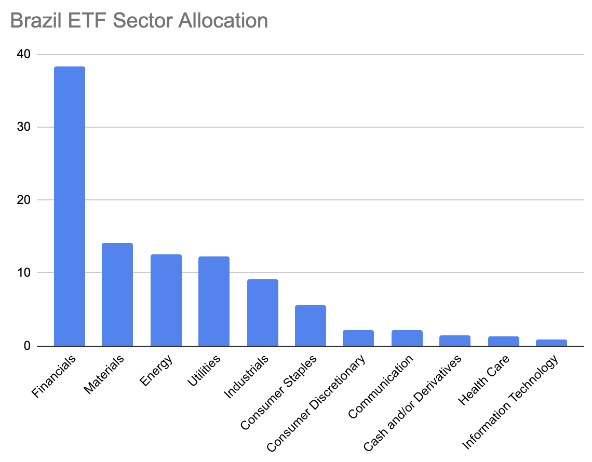

Let’s look at Nubank (NU), an exciting company in the fund.  Nubank offers a modern banking experience to 127 million customers in Brazil, Colombia, and Mexico.  The company is growing rapidly:

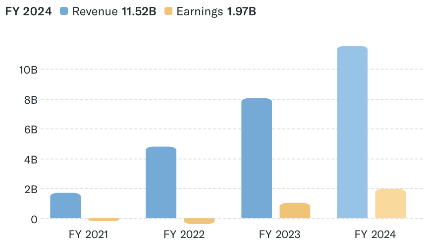

The market capitalization is $85 billion, and the trailing P/E is 34, so it’s not a super cheap stock, but it’s cool to see such an exciting Brazilian company!

Nubank is an outlier, and Brazilian stocks are very cheap overall relative to those in other countries.  Let’s take a look at some valuations.

## Idea Farm Brazil CAPE

The Idea Farm publishes valuations quarterly for most countries, and Brasil is currently the cheapest stock market in the world as of [December 2025](https://theideafarm.com/quarterly-global-valuations/global-valuations-12312025/).  Here are the abbreviations so you can understand the following tables:

* CAPE: Cyclically Adjusted Price Earnings
* CAPD: Cyclically Adjusted Price Dividends
* CAPCF: Cyclically Adjusted Price Cash Flow
* CAPB: Cyclically Adjusted Price Book

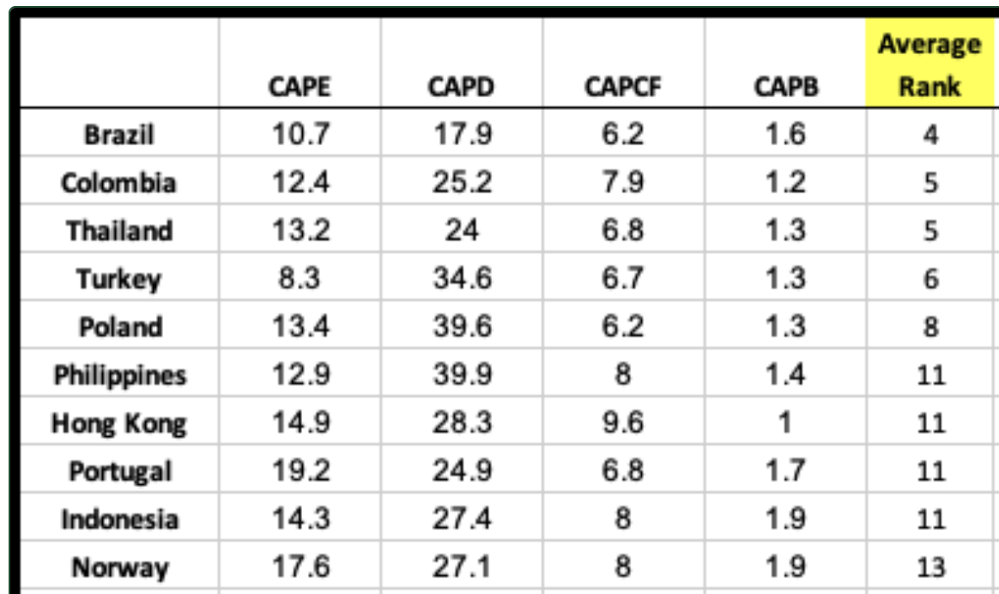

Here are the most expensive countries in the world based on these metrics:

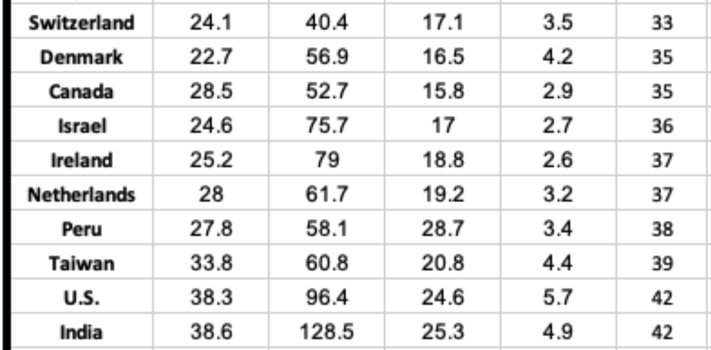

Brazil has a CAPE of 10.7, and the US CAPE is approximately 40 - a substantial difference.

Note that these numbers are from December 2025 and exclude the 20% increase in the Brazilian market from January 1, 2026, to February 13, 2026.

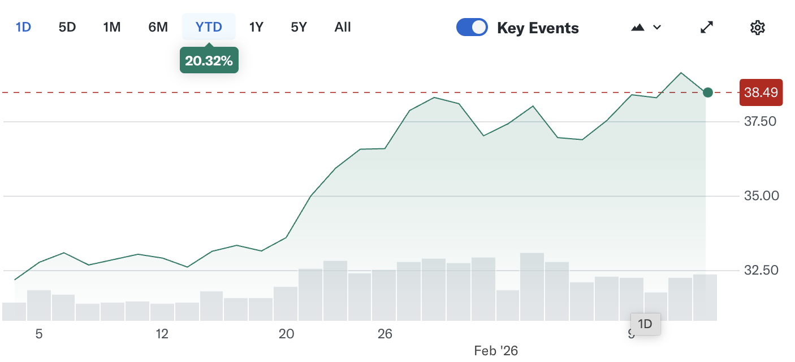

As of February 2026, Brazilian valuation ratios are higher but still among the lowest in the world.

Let’s take a look at the expected returns as computed by Research Affiliates.

## Research Affiliates Expected Returns

Here are the Research Affiliates Expected returns for the next 10 years for Brazil and other asset classes as of January 31, 2026:

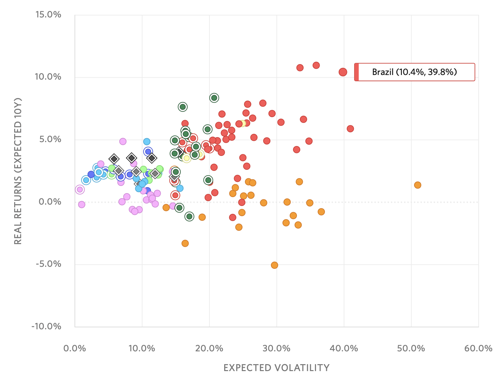

It’s nice how Research Affiliates presents the cumulative probability of a return and the probability of a 5% real return to accurately represent the range of possible outcomes from the Monte Carlo Simulation:

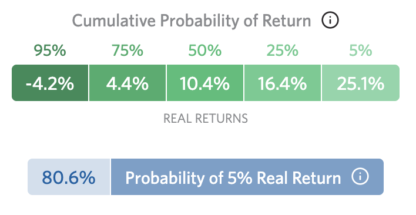

The Research Affiliates model expects the Brazilian stock market to be among the best-performing assets over the next 10 years.

## Brazil’s Hype Cycle

The Gartner hype cycle assesses the excitement level at the different stages of a new technology:

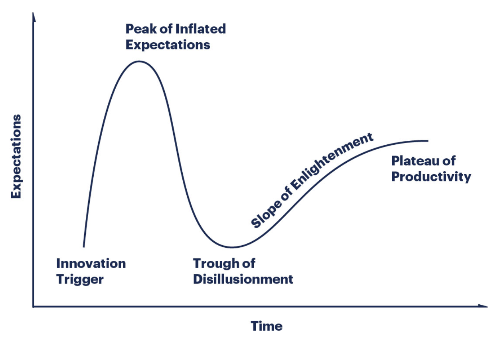

Let’s take a look at how the Brazilian stock market has weathered the cycle.

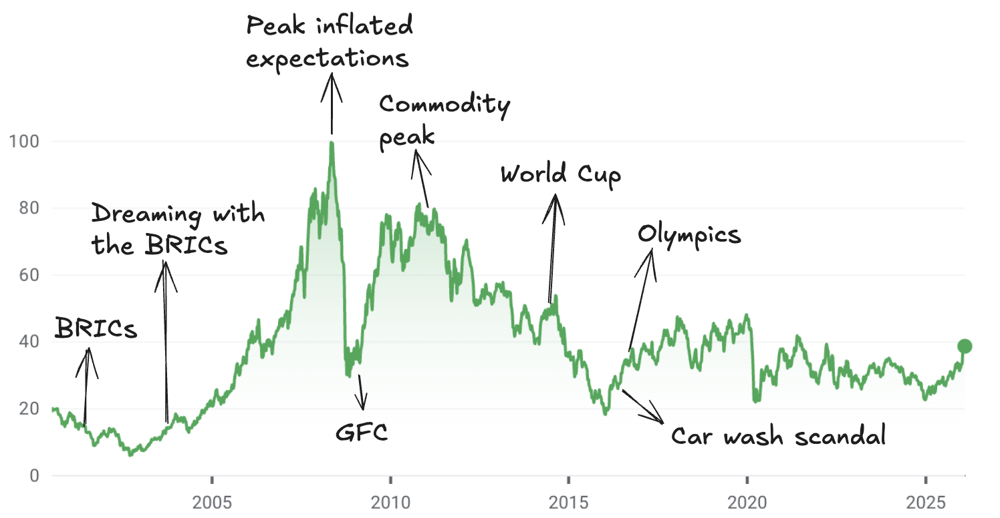

* 2001: BRIC term coined by Goldman Sachs
* October 2003: “Dreaming with the BRICs” report projecting that the BRIC economies could surpass the G6 by 2050
* Early 2008: first commodity supercycle peak
* May 2008: peak of inflated expectations
* July 2008: first commodity supercycle peak
* Late 2008: Global Financial Crisis
* 2011: Second commodity supercycle peak
* June 2014: World Cup in Brazil with lots of negative publicity about big government spending, while so many Brazilians live in poverty. To top it off, the Brazilian team lost spectacularly against Germany.
* March 2016: Peak car wash scandal
* August 2016: The Olympics in Brazil were very controversial; see [this video](https://youtu.be/-Y_m4ugjv_w?si=_NmWsJK7CG7oeGfy) for the full story.
* 2016 till 2025: trough of disillusionment

The prevailing sentiment in Brazil is one of complete capitulation and the belief that conditions will never improve.  Hardly any Brazilians are optimistic about the future of Brasil.  Let’s take a look at the Brazilian macroeconomic situation to see how well the feelings match the economic facts.

## Brazilian macroeconomic overview

Brasil is one of the largest economies in the world. Let’s see how it compares with the other big economies:

<table>
  <tr>
   <td>Country
   </td>
   <td>GDP (USD Trillion)
   </td>
   <td>Population (Million)
   </td>
   <td>Median Age
   </td>
  </tr>
  <tr>
   <td>United States
   </td>
   <td>27.4
   </td>
   <td>335
   </td>
   <td>38.9
   </td>
  </tr>
  <tr>
   <td>China
   </td>
   <td>17.8
   </td>
   <td>1412
   </td>
   <td>39.0
   </td>
  </tr>
  <tr>
   <td>Germany
   </td>
   <td>4.3
   </td>
   <td>84
   </td>
   <td>47.8
   </td>
  </tr>
  <tr>
   <td>Japan
   </td>
   <td>4.2
   </td>
   <td>124
   </td>
   <td>49.1
   </td>
  </tr>
  <tr>
   <td>India
   </td>
   <td>3.9
   </td>
   <td>1428
   </td>
   <td>28.2
   </td>
  </tr>
  <tr>
   <td>United Kingdom
   </td>
   <td>3.3
   </td>
   <td>68
   </td>
   <td>40.6
   </td>
  </tr>
  <tr>
   <td>France
   </td>
   <td>3.0
   </td>
   <td>65
   </td>
   <td>42.0
   </td>
  </tr>
  <tr>
   <td>Italy
   </td>
   <td>2.2
   </td>
   <td>59
   </td>
   <td>48.4
   </td>
  </tr>
  <tr>
   <td>Brazil
   </td>
   <td>2.1
   </td>
   <td>216
   </td>
   <td>33.2
   </td>
  </tr>
  <tr>
   <td>Canada
   </td>
   <td>2.1
   </td>
   <td>39
   </td>
   <td>41.1
   </td>
  </tr>
</table>

It’s also significantly younger than major economies such as Germany, Japan, and Italy.

According to [Goldman Sachs](https://www.goldmansachs.com/pdfs/insights/pages/gs-research/the-path-to-2075-slower-global-growth-but-convergence-remains-intact/report.pdf), Brasil is expected to be the 8th-largest economy in the world by 2050 and will remain a top-10 economy for the foreseeable future.  It’s a little ironic to rely on a Goldman Sachs report after their infamous “Dreaming with the BRICs” report from 2003.

Look at the real GDP growth rate in Brasil for the past 10 years:

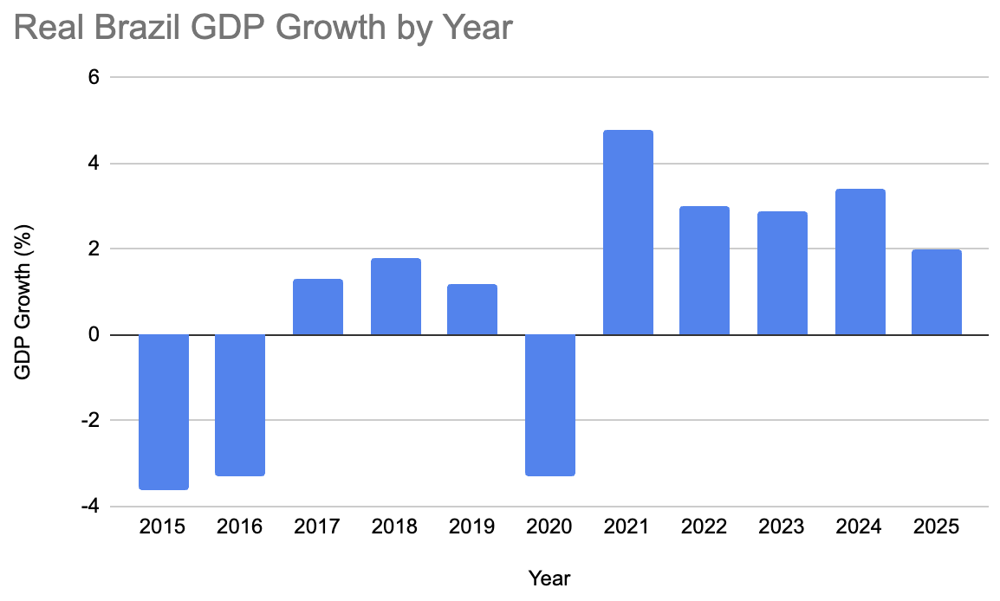

Brazil isn’t a rapidly growing economy, but it has shown positive growth over the past several years.

Now look at the inflation rate for the last 10 years:

Brazilian inflation is slightly elevated, but not severe.  The Brazilian central bankers were able to get the inflation spike from 2021 to 2022 under control by jacking up interest rates.

Let us examine some of the areas where the Brazilian economy is a world leader.

## Exciting Brazilian economic highlights

Brazil is a world-leader in several economic categories:

* Soybean exports (58% of global exports)
* Coffee exports
* Orange juice (76%)
* Beef exports (24%)
* PIX payment system

The Brazil PIX system processed approximately 90 billion transactions in 2025, far more than Bitcoin (~120 million) and FedNow (~8 million).  Brazil is ahead of the U.S. in the instant payments sector.
## Risks of investing in Brazil

The Economist has a great article titled [The rich would should be aware of Brazilification](https://www.economist.com/leaders/2026/02/12/the-rich-world-should-beware-brazilification) and here are some of the main points:

* Short term interest rates are 15%, so the government has a high interest expense
* Brazil needs to borrow 8% of GDP just to pay the interest expense
* The Brazilian government pays 10% of GDP on pensions
* Chronic Brazilian Real devaluation (although that has flipped recently)

The next presidential election will impact fiscal policies for the medium term.  To be determined if Brazil will continue spending and delaying austerity with the current administration or start cutting spending with a new administration.

## Conclusion

The Brazilian stock market is cheap, but the fundamentals are pretty good.

The economy is growing, inflation is under control and there are many young workers.

Brazil faces challenges, but it doesn’t have to confront an impending demographic bomb that other large world economies must deal with imminently.

EWZ appears to be an appealing investment opportunity for gaining exposure to Brazil.  It pays a generous 5% dividend, and the underlying assets are solid companies with good profit margins.

The best-case scenario for EWZ is that commodity prices rise, the dollar continues to depreciate against the Brazilian Real, and Brazil maintains sufficient political stability to allow the companies to prosper. It’s possible the next 10 years for Brasil will showcase solid growth that will exceed growth rates in other large economies.
