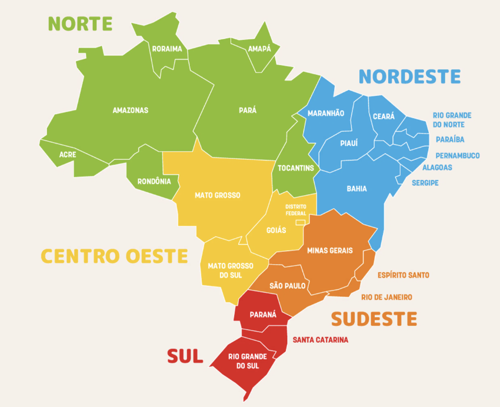

# Coastal trips in Brasil

This document outlines the less popular beach destinations in Brasil.

There are different times to visit the beach in Brasil:

* The North is best from August to November, when there is less rainfall and river levels are lower
* The Northeast is a massive region with different weather patterns
    * Northern Northeast: Fortaleza in Ceará is dry from August to September
    * Central Northeast: Natal/Recife is best from October to January
    * Southern Northeast: Maceió is best from October to February
* Southeast: Rio and São Paulo beaches are hot from December to March.
* South: Best from December to March for swimming in areas like Floripa.

The “best” time to visit certain beaches is debatable.  For example, Ilha Grande in Rio is great from December to February if you want really hot beach weather.  If you want milder weather with fewer mosquitoes, then Ilha Grande is better in the Brazilian winter from June to August.

Here’s a map of the different regions in Brasil:

## North

### Macapá

Macapá is the capital of Amapá and can be a unique vacation spot if you’re drawn to off-the-beaten-path destinations and want to experience life on the Amazon’s edge. It’s best known for the Equator Line Monument, where you can literally stand in both hemispheres, along with rich local culture and riverfront scenery. It’s less developed for tourism than other Brazilian cities, so expect simpler infrastructure.

### Belém

Belém, the capital of Pará, is worth visiting primarily for its exceptional Amazonian cuisine and the massive Ver-o-Peso Market, making it one of Brazil's best food cities. The city offers colonial architecture and serves as a gateway to Amazon River experiences.  It's a niche destination best suited for foodies, those seeking authentic northern Brazilian culture, or travelers doing comprehensive Brazil trips.

## Northeast

### São Luís and Lençóis Maranhenses

São Luís features Brazil's best-preserved Portuguese colonial architecture with stunning historical buildings in a UNESCO World Heritage historic center. Most visitors use it as a gateway to the spectacular Lençóis Maranhenses dunes.

The walkable historic center is photogenic and culturally rich.  The Bumba Meu Boi festivals are a fun way to learn about the mystical culture of Northern Brasil.

Lençóis Maranhenses National Park is one of Brazil’s most striking natural destinations, known for its vast white sand dunes and seasonal crystal-clear lagoons that form after the rainy season. Visitors typically explore the park through guided 4x4 tours, hiking, swimming, and nearby gateway towns like Barreirinhas and Santo Amaro do Maranhão, which offer access to different areas of the dunes and lagoons. The best time to visit is usually between June and September, when the lagoons are at their fullest, and the weather is sunny enough for outdoor activities.

### Jericoacoara and Preá

Jericoacoara is one of Brazil's premier beach destinations with world-class kitesurfing/windsurfing, dunes, and crystal-clear lagoons in a laid-back setting.  The village is car-free, and the streets are mainly made of sand. The consistent trade winds from July to January, pristine national park beaches, and water sports scene make it ideal for active travelers. It's a bit remote and requires effort to reach. 

Preá is a small beach village, known for its long sandy beaches, steady winds, and relaxed atmosphere. It’s a 30-minute drive from Jericoacoara.  It is especially popular with kitesurfers and windsurfers because of the strong trade winds and warm weather that last much of the year.  Preá offers a quieter alternative to the busier tourist town of Jericoacoara while still providing easy access to dunes, lagoons, and oceanfront restaurants.

### Fortaleza and Cumbuco

Fortaleza serves as a major gateway city to the northeast, with direct flights to Miami, urban beaches, and attractions such as Mercado dos Peixes (a fresh seafood market).  The beach parties at Praia do Futuro are amazing on weekends.

Cumbuco is an excellent kitesurfing/windsurfing destination 30 minutes from Fortaleza, with world-class conditions.  There are consistent winds from June through January, and Cauipe Lagoon has flat water, making it one of the top kite spots globally and perfect for water-sports enthusiasts like you.

### Natal and Pipa

Natal is one of Northeast Brazil's best beach cities with excellent beaches, dramatic sand dunes, year-round sunshine (300+ sunny days), and a laid-back atmosphere, making it ideal for beach lovers and outdoor enthusiasts. The city offers stunning beaches like Ponta Negra (with iconic Morro do Careca dune), famous Genipabu dunes for buggy tours and sandboarding, nearby Pipa Beach for dolphin watching, Maracajaú coral reefs for snorkeling, and the world's largest cashew tree, plus it's less crowded than Salvador or Recife. Best for 4-7 days, combining Natal city beaches with day trips to surrounding attractions, though it lacks the colonial architecture/walkability of cities like Salvador and has some safety concerns in certain areas requiring typical urban precautions.

Pipa is one of Brazil's most beautiful beach destinations, with four stunning beaches backed by cliffs, coconut palms, and Atlantic forest, and it is regularly visited by dolphins and sea turtles. The small, walkable village offers excellent restaurants, a laid-back international vibe, and activities such as surfing, dolphin watching, and beach hopping along its 6+ miles of spectacular coastline. It's perfect for 3-5 days of relaxed beach time and natural beauty, ideally combined with Natal as your gateway city.

### João Pessoa

João Pessoa is one of Brazil's greenest, most relaxed capital cities, with good urban beaches and the famous Jacaré Beach sunset saxophone performance.  It is the easternmost point of the Americas. The 400-year-old city offers colonial history, natural pools at Picãozinho, and a laid-back atmosphere.

Here’s a great video that showcases [the nicest neighborhood in João Pessoa](https://www.youtube.com/watch?v=pHhNYRD_T5w).

### Recife and Olinda

Recife serves as the gateway city with its historic colonial quarter and vibrant culture, but the city's main beach (Boa Viagem) has shark issues, and the real draw is Porto de Galinhas, which is 60km south and has some of Brasil’s best beaches with stunning natural pools, coral reefs, sea turtles, and crystal-clear waters perfect for snorkeling and swimming. Nearby Olinda offers beautiful colonial architecture, while Porto de Galinhas has multiple excellent beaches, including Muro Alto's calm waters and Maracaípe for surfing.

Olinda is a historic colonial city near Recife, famous for its colorful hillside streets, baroque churches, and vibrant cultural scene recognized by UNESCO as a World Heritage Site. The city is especially popular during Carnival, when traditional frevo music, giant puppets, and street parades create one of Brazil’s most lively cultural celebrations. Visitors also come for its artisan workshops, panoramic coastal views, museums, and relaxed atmosphere that blends history, art, and local northeastern Brazilian culture.

### Fernando de Noronha

Fernando de Noronha is one of Brazil’s most exclusive beach destinations, offering turquoise waters, dramatic cliffs, and a laid-back tropical atmosphere ideal for a luxury or nature-focused vacation. Visitors spend their days snorkeling, scuba diving, hiking scenic trails, watching dolphins at sunrise, and relaxing on beaches such as Baía do Sancho, often ranked among the world’s best. Because the islands limit visitor numbers to protect the environment, Fernando de Noronha feels peaceful and uncrowded, with boutique inns, fresh seafood, and a strong focus on eco-tourism.

### Maceió

Maceió is an excellent beach destination with 40km of stunning coastline, turquoise waters, natural pools accessible by raft tours, and a relaxed, small-city vibe that contrasts with larger, more developed Northeast capitals like Recife and Fortaleza. The city offers beautiful urban beaches (Pajuçara, Ponta Verde, Jatiúca) plus easy access to spectacular nearby beaches like Praia do Francês and Praia do Gunga, all with good hotel and restaurant infrastructure in a safe, tourism-friendly environment. A trip is ideally combined with the nearby town of Maragogi for a complete Alagoas coast experience.

### Aracaju

Aracaju is a pleasant, less-crowded Northeast beach city with a 5 km+ boardwalk (Orla de Atalaia) featuring restaurants, bars, the Northeast's largest oceanarium, and sparsely populated beaches where finding personal space is easy, making it a relaxed alternative to busier destinations like Recife or Fortaleza. The city is famous for crab cuisine, offers catamaran tours to sandbars and islands, sea turtle conservation visits, day trips to the spectacular Praia do Saco, 70km away, and the major Forró Caju festival in June.  The weather is best from September to March.

### Salvador

Salvador is Brazil's cultural capital and features the Americas' best-preserved Portuguese Baroque colonial architecture in the UNESCO-protected Pelourinho district, birthplace of capoeira and center of unique Afro-Brazilian culture with vibrant music/drumming traditions (Olodum), spectacular Carnival, and renowned Bahian cuisine like moqueca and acarajé. The city attracts 5+ million tourists annually.  It’s great for exploring culture/history/food, and ideally combined with Bahia's beach destinations.  Salvador is about colonial charm, Afro-Brazilian heritage, and phenomenal cultural experiences unavailable elsewhere in Brazil.

### Porto Seguro

Porto Seguro is a historically significant beach city where the Portuguese first landed in Brazil in 1500, featuring a well-preserved colonial historic center on a hilltop with churches and museums from the 1500s-1700s.  It's primarily known as a party/resort destination with massive beach clubs like Axé Moi and Tôa Tôa along Taperapuã Beach. The urban beaches are decent but not exceptional compared to Northeast Brazil standards.  The city gets extremely crowded during school holidays and Carnival. Nicer beaches are accessible via a quick ferry to Arraial d'Ajuda, or onward to Trancoso and Caraíva, which offer the authentic, pristine beach experiences.

## Southeast

### Vitoria / Guarapari

Guarapari is a good regional beach destination known as "Health City" for its unique medicinal monazite sands (believed to help with arthritis/rheumatism), and features 49 beaches with clear, calm waters rich in marine biodiversity.  Highlights include tucked-away Praia da Bacutia with rocky coves perfect for snorkeling, vibrant Meaípe Beach with lush castanheira trees, and excellent diving on coral reefs. The city attracts mainly domestic tourists (especially from Minas Gerais) and gets extremely crowded during Brazilian summer holidays (December-February), with many bars/restaurants/hotels closing or operating weekends-only during the quieter winter season when temperatures remain pleasant around 20°C. Guarapari doesn't compare to Northeast destinations like Porto de Galinhas, Jericoacoara, or Pipa, and lacks kitesurfing/wingfoiling infrastructure - best viewed as a convenient regional beach option rather than a must-visit destination worth traveling far to reach.

### North of Rio

Búzios has 20+ stunning beaches ranging from calm turquoise swimming coves (João Fernandes, Ferradura) to world-class surf spots (Geribá) and kitesurfing/windsurfing beaches (Manguinhos, Rasa), all wrapped around a sophisticated peninsula town featuring charming cobblestone streets (Rua das Pedras), upscale boutiques, excellent seafood restaurants, and vibrant nightlife. The must-do schooner boat tours cruise the coastline, stopping at secluded beaches and emerald waters for swimming/snorkeling, while the town offers a safe, upscale atmosphere.  It’s 2-3 hours from Rio de Janeiro, with ideal visiting times September-March for warm, sunny weather, offering the rare combination of natural beauty, water sports, sophisticated infrastructure, and beach-town charm that makes it one of Southeast Brazil's premier vacation destinations.

Arraial do Cabo is nicknamed "Brazilian Caribbean" with Brazil's "most perfect beach" (Praia do Farol) featuring pristine white sand and crystal-clear turquoise waters, plus world-class diving/snorkeling thanks to upwelling currents that create exceptional visibility and abundant marine life, including sea turtles, coral reefs, and humpback whales (July-September). The mandatory boat tours ($10-20) visit spectacular beaches like Gruta Azul cave, and Prainhas do Pontal, while the town maintains an authentic, non-commercialized small-fishing-village atmosphere with local guesthouses rather than mega-resorts - a refreshing contrast to glitzier Búzios. Water temperatures are cooler (18-22°C/64-72°F) than in typical tropical destinations.

### Between Rio and São Paulo

Ilha Grande is a car-free tropical paradise with 100+ pristine beaches, virgin Atlantic rainforest carpeting the mountainous interior, and spectacular hiking, including trails to Lopes Mendes (one of Brazil's most beautiful beaches) and Pico do Papagaio for sunrise trekking. The island's historical isolation preserved its extraordinary pristine condition with crystal-clear waters, abundant marine life, and an authentic small-village atmosphere untarnished by mass tourism, though visitors must bring all cash (no ATMs), accept limited infrastructure (no cars/roads, spotty WiFi), and pay island premium prices for accommodation and food. You can visit from May to October and should avoid December to March when the risk of mosquito-borne dengue fever is high. The island's lush rainforest environment means serious mosquito exposure, making seasonal timing essential for safety despite the year-round beautiful weather and beaches.

Paraty is one of Brazil's best-preserved Portuguese colonial UNESCO World Heritage towns, combining an exceptional car-free pedestrian historic center with colorful colonial architecture, 100+ pristine beaches accessible via boat tours, Atlantic rainforest waterfalls, and rich cultural heritage, including 60+ artisanal cachaça distilleries and the international FLIP literary festival. Located perfectly between Rio and São Paulo (4 hours from each), it offers a relaxed, safe, uncrowded escape with boat excursions to stunning beaches like Trinidade, natural pools like Lagoa Azul and Cachadaço, the unique Saco do Mamanguá tropical fjord, plus waterfall hikes and Gold Trail historical routes through virgin rainforest. It is best visited from April to November during the dry season.  It’s a great cultural complement to more beach-intensive destinations like Arraial do Cabo, Búzios, or Ilha Grande.

Ubatuba is nicknamed the "Surf Capital of São Paulo," with 100+ beaches along 100km of Atlantic rainforest-backed coastline offering excellent surfing conditions for all skill levels, island exploration (Ilha das Couves and Ilha Anchieta, with snorkeling and prison ruins), waterfalls, and the popular 7 Beaches Trail. However, the town has earned the nickname "Ubachuva" ("rain-Ubatuba") due to notoriously unpredictable rainfall from its proximity to Serra do Mar mountains - receiving some of the highest rainfall outside the Amazon - and becomes extremely crowded during summer/holidays with nightmare traffic and skyrocketing accommodation prices as São Paulo's 22 million residents descend on the coast. It is best visited from May to September for dry weather and fewer crowds, and requires a car to explore the spread-out coastline effectively.  It serves primarily as a domestic Brazilian destination rather than an international tourist hotspot.

Ilhabela has 40+ pristine beaches, from family-friendly calm waters to remote Bonete (ranked among Brazil's top 10 beaches accessible via a 12km Atlantic Forest trail), 360 waterfalls, 85% protected State Park with lush jungle hiking, world-class diving/snorkeling with sea turtles and tropical fish, plus a charming colonial Vila center.  It’s still relatively undiscovered by international tourists. However, the island is infamous for borrachudo sandflies, which give painful, itchy bites, especially near waterfalls/trails.  It requires a car to explore effectively since remote beaches and trails are spread across the island with limited public transport, and it gets extremely crowded on weekends/peak season when São Paulo's city residents descend on the coast.  It’s best to visit from May to September during the dry season to explore remote beaches like Bonete/Castelhanos, hike to waterfalls through the Atlantic rainforest, dive pristine waters, and enjoy a nature-focused island paradise that balances adventure with relaxation better than more developed resort destinations do.

## South

### Paraná

Ilha do Mel is a great vacation destination if you’re looking for a peaceful, nature-focused getaway with beautiful beaches and minimal crowds. The island is known for spots like the Farol das Conchas and the Fortaleza de Nossa Senhora dos Prazeres, offering both scenic views and a bit of history. Since cars are not allowed and infrastructure is simple, it’s best suited for travelers who enjoy a laid-back, rustic experience.

Matinhos can be a good vacation destination if you’re looking for a relaxed, budget-friendly beach trip, especially popular with locals from southern Brazil. Its main draw is the long stretch of coastline, including Praia Brava de Caiobá, known for good surf and a lively atmosphere during peak season. It’s less scenic and less developed for tourism than some other Brazilian beach spots.

Guaratuba is a solid vacation destination if you’re looking for a laid-back beach town with a mix of nature and local culture. It offers wide sandy beaches, such as Praia Central de Guaratuba, and scenic surroundings near Baía de Guaratuba, making it great for relaxing and casual outdoor activities. While it’s quieter and less polished than major resort areas, that’s part of its appeal if you prefer a more low-key, authentic vibe.

### Balneário Camboriú

Balneário Camboriú is one of Brazil’s most developed and energetic beach destinations, often compared to a mini Miami because of its tall skyline, upscale vibe, and busy nightlife. The main strip along Praia Central is packed with restaurants, bars, and shops, while nearby attractions like Parque Unipraias offer scenic views, hiking trails, and access to quieter beaches such as Laranjeiras. It’s a great choice if you want a mix of beach relaxation, nightlife, and urban convenience, but expect higher prices, heavy summer crowds, and a more commercial feel than in quieter coastal towns.

### Bombinhas

Bombinhas is an excellent vacation destination if you’re looking for clear water, beautiful scenery, and a more relaxed atmosphere than Brazil’s bigger beach cities. It’s especially known for beaches like Praia de Bombinhas and Praia da Sepultura, which are great for swimming, snorkeling, and diving thanks to their calm, transparent waters. While it can get crowded and pricey in peak season, it’s widely considered one of the best beach areas in southern Brazil for nature and coastal beauty.

### Floripa

Florianópolis (“Floripa”) is widely considered one of Brazil’s best vacation destinations thanks to its mix of over 40 beaches and lively nightlife. You can surf all over the island, relax in calmer waters at Lagoa da Conceição, or explore charming historic areas like Santo Antônio de Lisboa. It works well for many travel styles—whether you want nature, beach hopping, or a social atmosphere—but having a car helps since the island is large and spread out.

### Praia do Rosa

Praia do Rosa is an excellent vacation destination if you’re looking for a mix of natural beauty, a relaxed vibe, and a touch of upscale charm. The beach is known for its clean waters, rolling hills, and seasonal whale watching, and nearby spots like Lagoa do Meio add variety for swimming and kayaking. It’s more rustic than big resort cities but still has great restaurants and boutique pousadas, making it ideal if you want something scenic and low-key without feeling too remote.

### Torres

Torres is a great vacation destination if you want something visually distinct from most Brazilian beach towns. It’s famous for its dramatic cliffs, especially around Parque da Guarita, which create striking ocean views you won’t find in flatter coastal areas nearby. The town has a relaxed, family-friendly feel with decent infrastructure, though the water can be cooler and the weather a bit less tropical than beaches further north.
