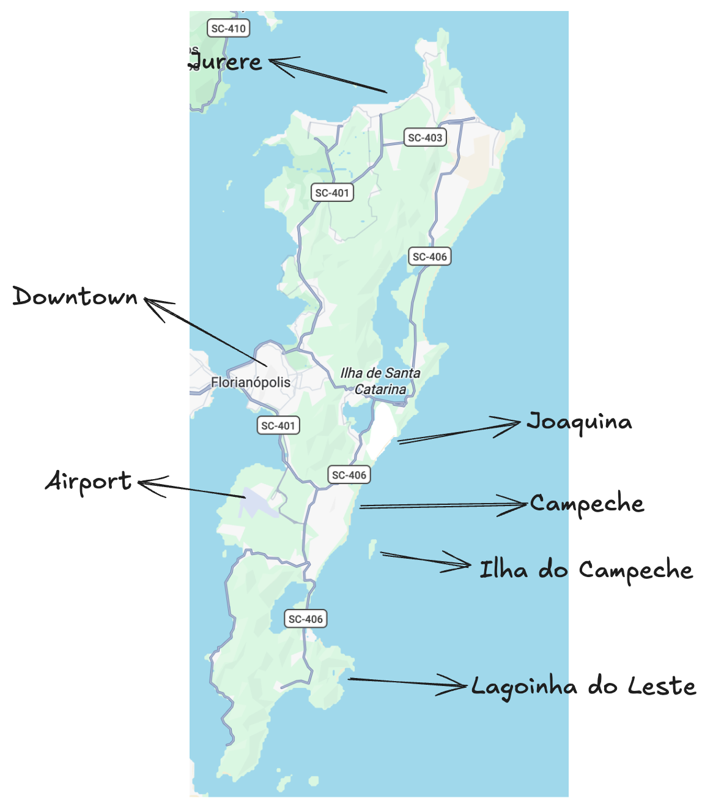
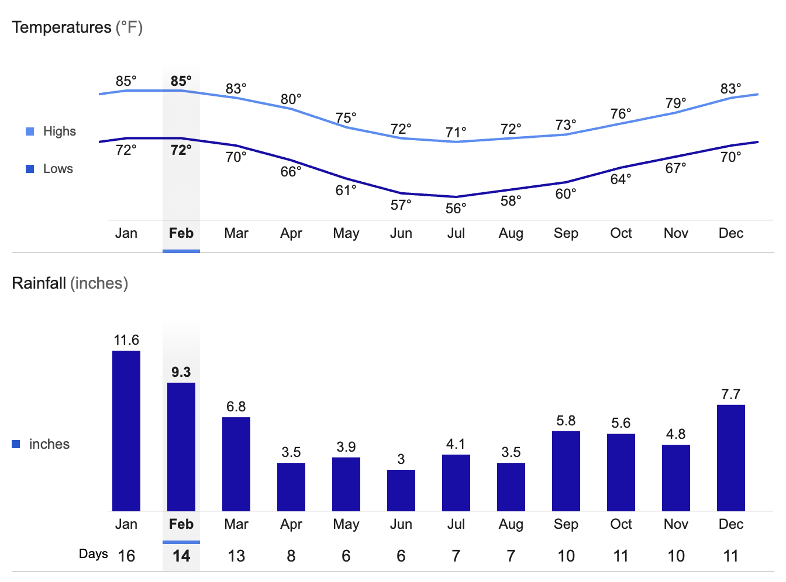
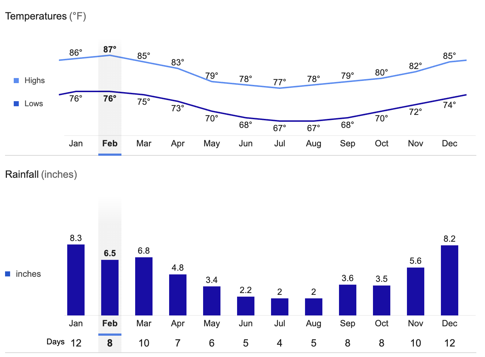
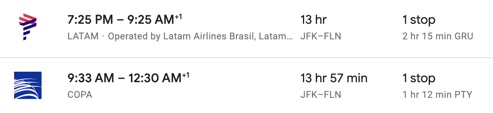
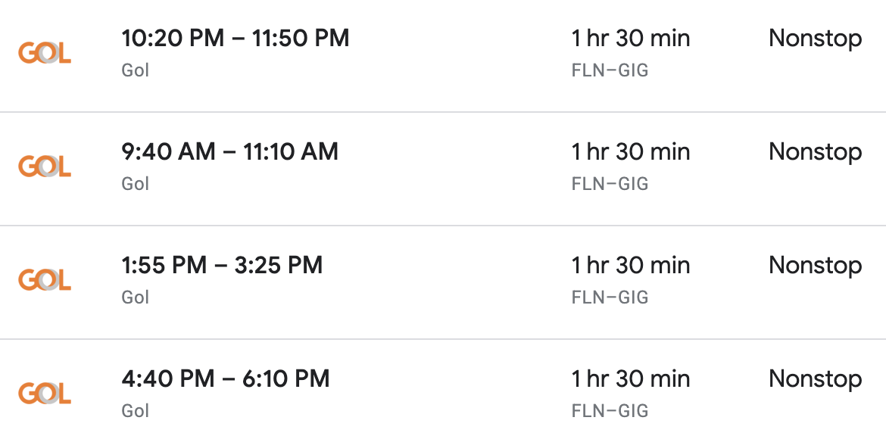
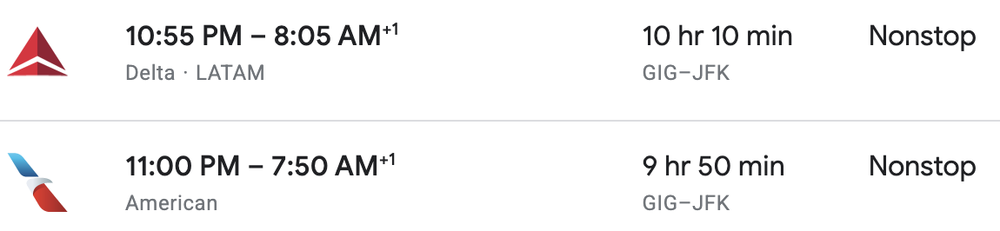

# Brasil First Time Travel Guide

This post outlines a sample trip itinerary for visiting Brasil and having maximum fun!

It covers the best seasons, flight logistics, and fun activities.

Brazil is a massive country, and it’s hard to pick just two cities, but Florianopolis (Floripa) and Rio would make for a great first-time trip!  Floripa has amazing nature, beaches, yoga, and chilled-out vibes.  Rio offers the full Brazilian experience, with the iconic Copacabana, Ipanema, and Leblon beaches and nightlife.  

## Florianopolis Activities

Florianopolis is an idyllic island in southern Brasil that’s famous for beaches, nature, hiking, and good vibes.

It’s easy to get an Uber anywhere on the island, so transportation is never an issue.

Let’s take a look at the top spots on the island and fun activities.

[Campeche](https://youtu.be/4qVQIPUtnGU?si=CX3OCXOZ1tu53tnX) is a great place to stay. It’s next to an amazing beach, has lots of restaurants, and is central to different spots on the island.  The entire east coast of Floripa has waves, so it’s a fun place to swim.

It only takes around 10 minutes to get from the airport to Campeche, so it’s really easy to get to your Airbnb when you arrive.

Here are some of the fun day trips in the south of the island:

* [Ilha do Campeche](https://youtu.be/fBf4CtakJJ4?si=Ymyxi9bKblBmOiia)
* Stand up paddleboarding in [Lagoa do Peri](https://www.youtube.com/watch?v=bJl9o5--34k)
* [Matadeiro Beach](https://www.youtube.com/watch?v=o88f_63uRqM) mini hike (30 mins)
* Lagoinha do Leste hike (~1.5 hours each way) is excellent and has a popular spot for Instagram photos.

The center of the island also has some great activities:

* Joaquina Beach is more crowded and a famous surfing destination. Here’s [a video with some waves](https://www.youtube.com/watch?v=CwGfcxsJpyk&list=RDCwGfcxsJpyk&start_radio=1).
* Joaquina also features impressive sand dunes that are ideal for sunsets or sandboarding.
* Barra da Lagoa is [the super chill longboard wave](https://youtu.be/YVjAJkGnjDM?si=Bev_Ew6eapxqx0RH).
* The large lake in the center of the island is called Lagoa da Conceição and is great for sailing or kite surfing.	

The northern part of the island is one of the wealthiest parts of Brasil.  It’s a great place to see multi-million dollar mansions and yachts.

* There is a fun club, and we can go to a [pool party](https://www.youtube.com/watch?v=kFx_i7gB6dA). The [P12 concerts](https://youtu.be/PLrAVWBHads?si=9ZuOExJEUcHHpcMj) are also pretty epic.
* Walking from Canasvieiras to Jurare Beach is so nice. Daniela Beach is also amazing.
* Pria Brava, in the most northeastern portion of the island, also offers a challenging hike with a next-level view.

## Rio Activities

Watch the [Girl From Ipanema](https://youtu.be/NldPFVKYmiw?si=etPdPYXwNfIjLpiT) video by Frank Sinatra to get motivated.  Watch [this music video](https://youtu.be/i1Nm-MJ313w?si=NPOlezz0ux69Wu2Y) to get an idea of the city setup of Rio. I think it’s the most beautiful big city + nature combo in the world.

You could stay in Rio for just a few days and have a lot of fun.  The Leblon, Ipanema, and Copacabana beaches are iconic.  Walking on the beach of the promenade is so nice.  There are huge mountains right next to the beach, and it is unlike anything you’ve ever seen before.

Sugarloaf Mountain and Christ the Redeemer are must-visit. The botanical garden is also incredible.  

It’s a great place to check out Michelin-starred restaurants because they’re so affordable.  Brazil is really cheap right now, and I don’t think it will stay that way for much longer, so it’s a great time to capitalize on the great prices.

The people from Rio are called “cariocas,” and they have a unique accent, culture, and style.  They are effortlessly cool - you’ll see it when you hit the beach.

## Best months

March/April are good months for Floripa.  It’s still plenty hot, less rainy, and less crowded.  Peak tourist months are December, January, and February.

February is also awesome.  It's a great time to enjoy the fun carnaval parties!

March and April are also great months for Rio.

## Logistics

Let’s look at a NYC => Florianopolis => Rio => back to NYC trip.

NYC => Floripa flights are pretty easy (timezone change is minimal):

Floripa to Rio is super-easy:

There are nonstop flights from Rio to New York during the Brazilian summer (NY winter):

